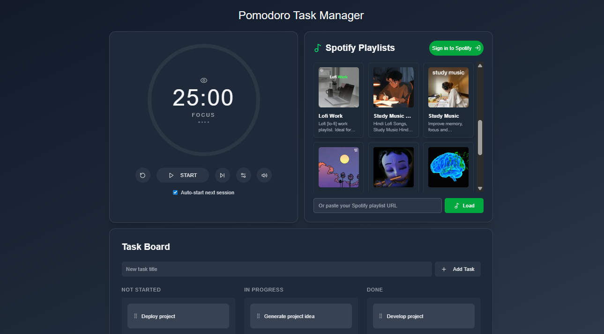
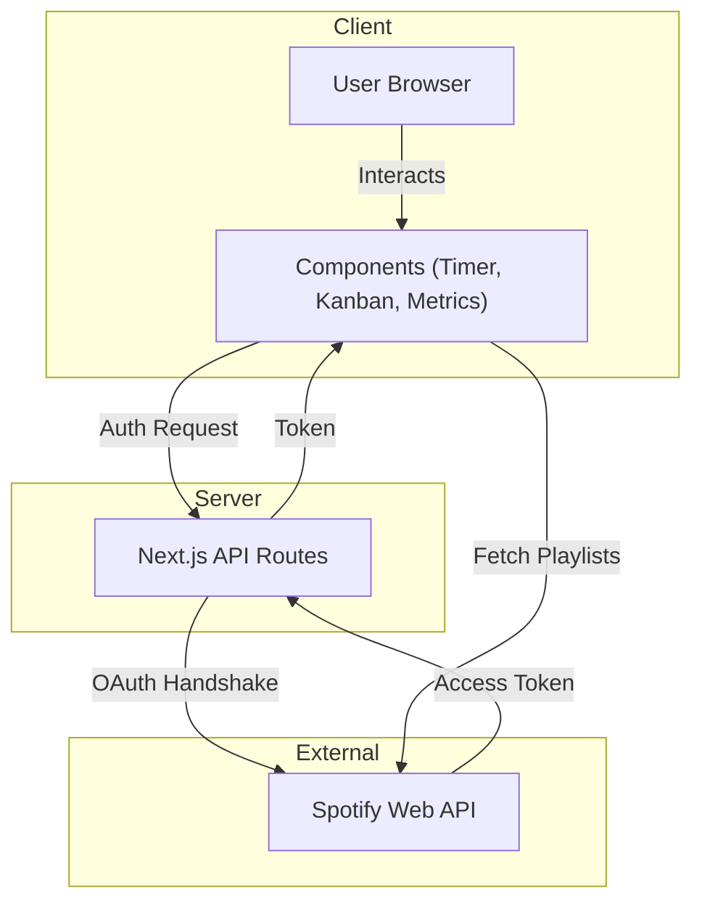

<a name="readme-top"></a>

<br />
<div align="center">
  <a href="https://github.com/priyanshubh/focusflow">
    
  </a>

  <h3 align="center">FocusFlow</h3>

  <p align="center">
    The Ultimate Productivity Hub: Pomodoro + Kanban + Spotify
    <br />
    <a href="https://focusflow-pb.vercel.app"><strong>View Demo »</strong></a>
    <br />
    <br />
    <a href="https://github.com/priyanshubh/focusflow">View Code</a>
    ·
    <a href="https://github.com/priyanshubh/focusflow/issues">Report Bug</a>
    ·
    <a href="https://github.com/priyanshubh/focusflow/issues">Request Feature</a>
  </p>
</div>

<div align="center">
  
  
  
  
  
</div>

<br />

<details>
  <summary>Table of Contents</summary>
  <ol>
    <li><a href="#-about-the-project">About The Project</a></li>
    <li><a href="#-key-features">Key Features</a></li>
    <li><a href="#-tech-stack">Tech Stack</a></li>
    <li><a href="#-architecture">Architecture</a></li>
    <li><a href="#-getting-started">Getting Started</a></li>
    <li><a href="#-contributing">Contributing</a></li>
    <li><a href="#-contact">Contact</a></li>
  </ol>
</details>

---

## 🤖 About The Project

**FocusFlow** is an all-in-one productivity application designed to help you get into the "flow state" and stay there. By combining the proven **Pomodoro Technique** with a flexible **Kanban Board** for task management and seamless **Spotify Integration** for focus music, FocusFlow eliminates the need to switch between multiple tabs.

Built with the latest **Next.js 15** and **Tailwind CSS 4**, it offers a modern, responsive, and highly customizable user experience.

<div align="center">
  
</div>

---

## 🔥 Key Features

- **🍅 Advanced Pomodoro Timer**
  Customizable work/break intervals, audio notifications (`bell1.wav`), and a mini-widget mode to keep time visible without distractions.

- **📋 Drag-and-Drop Kanban Board**
  Organize tasks into "To Do," "In Progress," and "Done" columns. Manage your workflow visually to prioritize what matters.

- **🎵 Spotify Integration**
  Connect your Spotify account directly within the app. Select playlists and control playback without leaving your focus zone.

- **📊 Productivity Metrics**
  Track your performance with `YourMetrics`—visualize how many focus sessions you've completed and your daily activity.

- **🎨 Modern UI/UX**
  Built with **Radix UI** and **Shadcn/ui** components for accessibility and aesthetics. Includes Dark/Light mode theming and smooth **Framer Motion** animations.

---

## ⚙️ Tech Stack

| Category | Technology | Description |
| :--- | :--- | :--- |
| **Framework** |  | App Router, Server Actions, and latest React 19 features. |
| **Language** |  | Fully typed codebase for reliability and maintainability. |
| **Styling** |  | The latest engine of Tailwind for ultra-fast styling. |
| **Components** |  | Headless, accessible UI primitives powering the interface. |
| **Integrations** |  | Spotify Web API for authentication and player control. |
| **State** |  | React Context for managing Timer and Auth states. |

---

## 🏗 Architecture

---

## 📂 Folder Structure

The project follows a modern Next.js App Router structure:

```text
focusflow/
├── app/                  # App Router Pages & Layouts
│   ├── api/spotify/      # Backend API routes for Spotify Auth
│   ├── callback/         # Spotify OAuth callback page
│   ├── page.tsx          # Main Dashboard
│   └── layout.tsx        # Root layout with Theme Provider
├── components/           # UI & Feature Components
│   ├── ui/               # Reusable Shadcn/Radix components (Buttons, Cards, etc.)
│   ├── KanbanBoard.tsx   # Task management logic
│   ├── PomodoroTimer.tsx # Timer logic & controls
│   ├── PlaylistCard.tsx  # Spotify playlist UI
│   └── SettingsModal.tsx # User preferences
├── contexts/             # Global State (TimerContext)
├── hooks/                # Custom React Hooks
├── lib/                  # Utilities (Tailwind merge, etc.)
├── utils/                # API helpers (SpotifyApi.ts)
└── public/               # Static assets (Logos, Bell sounds)

```

---

## 🧰 Getting Started

Follow these steps to set up the project locally.

### Prerequisites

* **Node.js** (v18 or higher)
* **Spotify Developer Account** (to get API keys)

### Installation

1. **Clone the repository**
```bash
git clone [https://github.com/priyanshubh/focusflow.git](https://github.com/priyanshubh/focusflow.git)
cd focusflow

```


2. **Install dependencies**
```bash
npm install
# or
yarn install
# or
pnpm install

```


3. **Spotify App Setup**
* Go to the [Spotify Developer Dashboard](https://developer.spotify.com/dashboard).
* Create an app and get your **Client ID** and **Client Secret**.
* Add `http://localhost:3000/callback` to the Redirect URIs in settings.


4. **Environment Variables**
Create a `.env.local` file in the root directory and add:
```env
NEXT_PUBLIC_SPOTIFY_CLIENT_ID=your_client_id
SPOTIFY_CLIENT_SECRET=your_client_secret
SPOTIFY_REDIRECT_URI=http://localhost:3000/callback

```


5. **Run the application**
```bash
npm run dev

```


Open [http://localhost:3000](https://www.google.com/search?q=http://localhost:3000) to view it in the browser.

---

## 🔧 Contributing

Contributions are what make the open source community such an amazing place to learn, inspire, and create. Any contributions you make are **greatly appreciated**.

1. Fork the Project
2. Create your Feature Branch (`git checkout -b feature/AmazingFeature`)
3. Commit your Changes (`git commit -m 'Add some AmazingFeature'`)
4. Push to the Branch (`git push origin feature/AmazingFeature`)
5. Open a Pull Request

---

## 🚀 Follow Me

<div align="center">
  <a href="https://github.com/priyanshubh">
    
  </a>
  <a href="https://linkedin.com/in/priyanshu-bharti">
    
  </a>
  <a href="https://priyanshubharti.vercel.app">
    
  </a>
</div>

<br />
<p align="center">Built with ❤️ by <a href="https://www.google.com/search?q=https://github.com/priyanshubh">Priyanshu Bharti</a></p>

