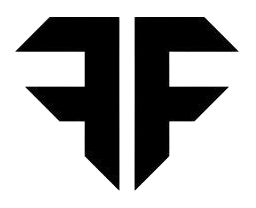
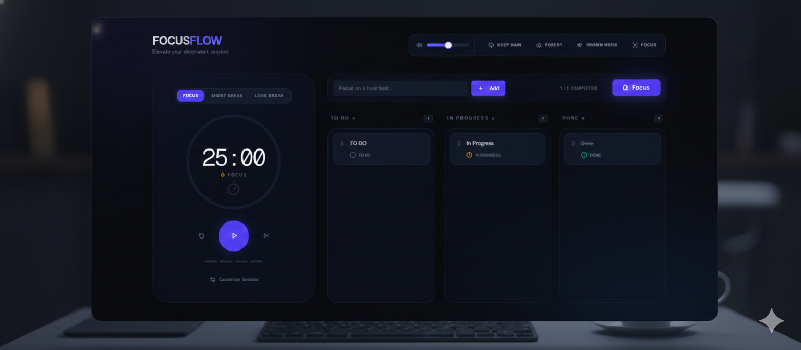
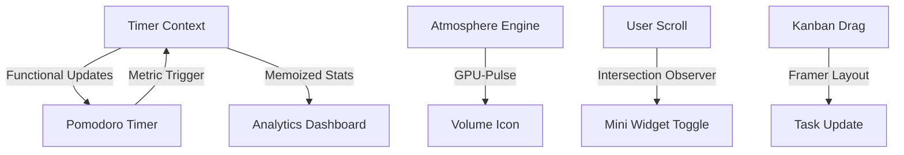

<a name="readme-top"></a>

<br />
<div align="center">
  <a href="https://github.com/priyanshubh/focusflow">
    
  </a>

  <h3 align="center">FocusFlow</h3>

  <p align="center">
    
<strong>A Professional Sanctuary for Deep Work: Pomodoro + Kanban + Atmosphere Engine</strong>
    <br />
    <a href="https://focusflow-pb.vercel.app"><strong>View Demo »</strong></a>
    <br />
    <br />
    <a href="https://github.com/priyanshubh/focusflow">View Code</a>
    ·
    <a href="https://github.com/priyanshubh/focusflow/issues">Report Bug</a>
    ·
    <a href="https://github.com/priyanshubh/focusflow/issues">Request Feature</a>
  </p>
</div>

<div align="center">
  
  
  
  
  
</div>

<br />


<details>
<summary>Table of Contents</summary>
<ol>
<li><a href="#-about-the-project">About The Project</a></li>
<li><a href="#-key-features">Key Features</a></li>
<li><a href="#-tech-stack">Tech Stack</a></li>
<li><a href="#-performance-architecture">Performance Architecture</a></li>
<li><a href="#-getting-started">Getting Started</a></li>
<li><a href="#-contributing">Contributing</a></li>
</ol>
</details>

---

## 🤖 About The Project

**FocusFlow** is a premium, distraction-free productivity dashboard designed to facilitate the "Flow State." By consolidating a **High-Precision Pomodoro Timer**, a **Minimalist Kanban Board**, and an **Integrated Atmosphere Engine** into a single hardware-accelerated interface, FocusFlow eliminates the cognitive load of switching between apps.

Built with **Next.js 15**, **React 19**, and the **Midnight Slate** design system, it delivers a smooth, professional experience even on lower-specification hardware.

<div align="center">

</div>

---

## 🔥 Key Features

* **🍅 Precision Pomodoro System**
Features custom work/break intervals and a **Mini-Widget Mode** that automatically appears via Intersection Observer when you scroll, keeping your timer visible at all times.
* **📋 Deep Work Kanban Board**
A visual task manager designed for clarity. Includes drag-and-drop functionality and a workspace reset feature to keep your environment clutter-free.
* **🍃 Native Atmosphere Engine**
Replaces external streaming widgets with a lightweight, built-in audio engine. Includes professionally curated **Brown Noise, Rain, and Forest** soundscapes with smooth volume pulsing animations.
* **📊 Performance Analytics**
A robust metrics suite that tracks **Daily Streaks**, **Focus Intensity**, and **Best Streaks** using intelligent consecutive-date validation logic.
* **🎨 Midnight Slate Design**
A professional glassmorphism aesthetic built with **Tailwind CSS 4** and **Radix UI**, optimized for reduced eye strain during long-duration focus sessions.

---

## ⚙️ Tech Stack

| Category | Technology | Description |
| --- | --- | --- |
| **Framework** | **Next.js 15** | App Router architecture with React 19 concurrent features. |
| **Styling** | **Tailwind 4** | Ultra-efficient utility engine for modern design systems. |
| **Animations** | **Framer Motion** | GPU-accelerated micro-interactions and spring physics. |
| **Components** | **Shadcn UI** | Accessible, headless UI primitives via Radix UI. |
| **State** | **Context API** | Unified global state for timer logic and performance metrics. |

---

## 🏗 Performance Architecture

To ensure a lightweight experience, FocusFlow utilizes a specialized rendering strategy:



* **GPU Offloading**: Animations use compositor-only properties (`scale`, `opacity`) to ensure 60fps on older CPUs.
* **Memoization**: `React.memo` and `useCallback` prevent unnecessary re-renders during the 1-second timer tick.

---

## 📂 Folder Structure

```text
focusflow/
├── app/                  # App Router Pages & Layouts
│   ├── page.tsx          # Main Dashboard
│   └── layout.tsx        # Root layout with TimerProvider
├── components/           
│   ├── AtmosphereEngine  # Built-in ambient sound controls
│   ├── KanbanBoard       # Drag-and-drop task management
│   ├── PomodoroTimer     # Main timer & Mini-widget logic
│   ├── YourMetrics       # Performance analytics dashboard
│   └── ui/               # Optimized Shadcn primitives
├── contexts/             # Global State (Timer & Metrics)
├── public/               # Audio assets (Zen Bell, Brown Noise)
└── utils/                # Date validation & calculation helpers

```

---

## 🧰 Getting Started

### Prerequisites

* **Node.js** (v18 or higher)

### Installation

1. **Clone the repository**
```bash
git clone https://github.com/priyanshubh/focusflow.git
cd focusflow

```


2. **Install dependencies**
```bash
npm install

```


3. **Run the development server**
```bash
npm run dev

```


---

## 🔧 Contributing

Contributions are welcome! If you have ideas for professional features or performance improvements:

1. Fork the Project
2. Create your Feature Branch (`git checkout -b feature/AmazingFeature`)
3. Commit your Changes (`git commit -m 'Add some AmazingFeature'`)
4. Open a Pull Request

---

## 🚀 Follow Me


<div align="center">
  <a href="https://github.com/priyanshubh">
    
  </a>
  <a href="https://linkedin.com/in/priyanshu-bharti">
    
  </a>
  <a href="https://priyanshubharti.vercel.app">
    
  </a>
</div>

<br />
<p align="center">Built with ❤️ by <a href="https://github.com/priyanshubh">Priyanshu Bharti</a></p>