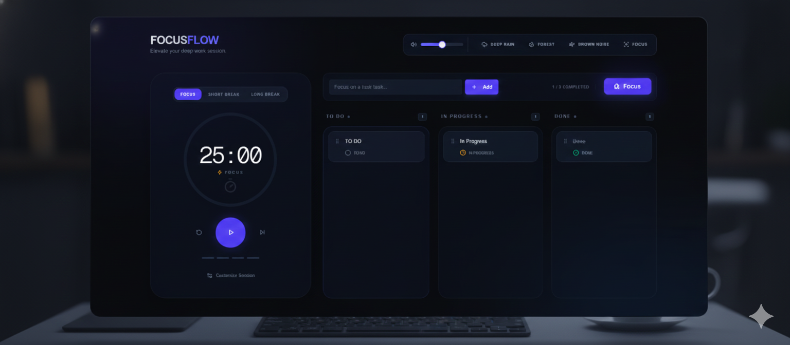
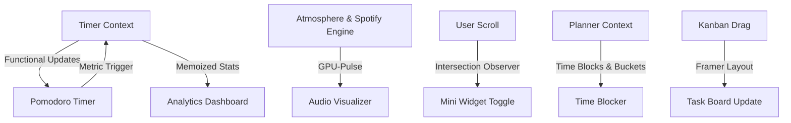

<a name="readme-top"></a>

<br />
<div align="center">
  <a href="https://github.com/priyanshubh/focusflow">
    
  </a>

  <h3 align="center">FocusFlow | Minimalist Deep Work Dashboard</h3>

  <p align="center">
    <strong>A Sleek, Minimalist Sanctuary for Deep Work: Horizontal Pomodoro + Unified Time Blocker + Kanban + Ambient Sound Engine</strong>
    <br />
    <a href="https://focusflow-pb.vercel.app"><strong>View Demo »</strong></a>
    <br />
    <br />
    <a href="https://github.com/priyanshubh/focusflow">View Code</a>
    ·
    <a href="https://github.com/priyanshubh/focusflow/issues">Report Bug</a>
    ·
    <a href="https://github.com/priyanshubh/focusflow/issues">Request Feature</a>
  </p>
</div>

<div align="center">
  
  
  
  
  
</div>

<br />

<details>
<summary>Table of Contents</summary>
<ol>
<li><a href="#-about-the-project">About The Project</a></li>
<li><a href="#-key-features">Key Features</a></li>
<li><a href="#-keyboard-shortcuts">Keyboard Shortcuts</a></li>
<li><a href="#-tech-stack">Tech Stack</a></li>
<li><a href="#-performance-architecture">Performance Architecture</a></li>
<li><a href="#-folder-structure">Folder Structure</a></li>
<li><a href="#-getting-started">Getting Started</a></li>
<li><a href="#-contributing">Contributing</a></li>
</ol>
</details>

---

## 🤖 About The Project

**FocusFlow** is a premium, distraction-free productivity dashboard engineered to trigger and sustain the **"Flow State."** By consolidating a **High-Precision Pomodoro Timer**, a **Unified Visual Time Blocker & Task Bucket Grid**, a **Minimalist Kanban Board**, and an **Integrated Ambient Audio Engine** into a sleek, horizontal, hardware-accelerated interface, FocusFlow eliminates app-switching friction and cognitive fatigue.

Built with **Next.js 15**, **React 19**, **PWA capabilities**, and the **Midnight Slate** design system, it delivers a liquid-smooth 60fps experience even on modest hardware.

<div align="center">

</div>

---

## 🔥 Key Features

* **🍅 Precision Pomodoro System & Zen Mode**
  * Custom work, short break, and long break intervals.
  * **Zen Mode / Fullscreen** for pure zero-distraction focus.
  * **Mini-Widget Mode** automatically triggered via `IntersectionObserver` when scrolling down, keeping your active timer pinned.

* **📅 Unified Time Blocker & Task Buckets**
  * **Horizontal Density Layout**: Perfectly aligned, scrollbar-free grids to view your entire day at a glance.
  * **Timeline View**: Schedule deep work blocks, meetings, and routines with an elegant, floating slide-up modal.
  * **4 Task Buckets**: Organize tasks into *Today Focus*, *Daily Routine*, *Quick Win (<15m)*, and *Someday/Later*.
  * **End-of-Day Reset**: One-click daily reset to clear completed tasks and push unfinished work to tomorrow.

* **📋 Deep Work Kanban Board**
  * Smooth drag-and-drop task management divided into *To Do*, *In Progress*, and *Done*.
  * Built-in session tracking and workspace reset.

* **🎵 Spotify & Native Ambient Audio Engine**
  * **Atmosphere Engine**: Built-in, zero-latency ambient soundscapes (*Brown Noise, Rain, Forest*) with smooth volume pulsing.
  * **Spotify Integration**: Connect your Spotify account to stream curated focus playlists directly within the dashboard.

* **⚡ Power Keyboard Navigation**
  * Global shortcuts for hands-on-keyboard efficiency (`Space` to toggle timer, `F` for Zen Mode, `R` to reset, `?` for cheat sheet).

* **📲 Progressive Web App (PWA) & Offline Mode**
  * Full PWA manifest & Service Worker offline caching.
  * Native installation support on Desktop, iOS, and Android.
  * Offline status banner when working without an active network connection.

* **📊 Performance Analytics & Metrics**
  * Real-time metrics tracking **Daily Streaks**, **Focus Intensity**, and **Best Streaks** with date validation.

---

## ⚡ Keyboard Shortcuts

| Shortcut | Action |
| --- | --- |
| <kbd>Space</kbd> | Start / Pause Timer |
| <kbd>F</kbd> | Toggle Zen / Fullscreen Mode |
| <kbd>R</kbd> | Reset Timer |
| <kbd>S</kbd> | Skip to Next Session |
| <kbd>N</kbd> | Focus New Task Input |
| <kbd>Esc</kbd> | Exit Zen Mode |
| <kbd>?</kbd> | Open Keyboard Shortcuts Menu |

---

## ⚙️ Tech Stack

| Category | Technology | Description |
| --- | --- | --- |
| **Framework** | **Next.js 15** | App Router architecture with React 19 concurrent features. |
| **Styling** | **Tailwind 4** | Ultra-efficient utility engine with custom Midnight Slate theme. |
| **Animations** | **Framer Motion** | GPU-accelerated layout transitions and spring physics. |
| **Components** | **Shadcn UI** | Accessible headless primitives powered by Radix UI. |
| **State** | **Context API** | Unified `TimerContext` & `PlannerContext` state trees. |
| **Audio** | **Web Audio API & Spotify Web API** | Native low-overhead sound synthesis and Spotify streaming. |
| **PWA** | **Service Workers** | Offline availability and desktop/mobile installation. |

---

## 🏗 Performance Architecture


```mermaid
graph TD
    A[Timer Context] -->|Functional Updates| B[Pomodoro Timer]
    A -->|Memoized Stats| C[Analytics Dashboard]
    D[Atmosphere & Spotify Engine] -->|GPU-Pulse| E[Audio Visualizer]
    F[User Scroll] -->|Intersection Observer| G[Mini Widget Toggle]
    H[Planner Context] -->|Time Blocks & Buckets| I[Time Blocker]
    B -->|Metric Trigger| A
    J[Kanban Drag] -->|Framer Layout| K[Task Board Update]
```

* **Compositor GPU Offloading**: Animations leverage GPU-accelerated CSS properties (`transform`, `opacity`) for steady 60fps performance.
* **Smart Re-renders**: `React.memo`, `useCallback`, and context splitting prevent whole-tree rerenders during timer ticks.

---

## 📂 Folder Structure

```text
focusflow/
├── app/                  # App Router Pages & API Routes
│   ├── api/spotify/      # Spotify OAuth & Player API Routes
│   ├── layout.tsx        # Root layout with providers & PWA register
│   ├── manifest.ts       # PWA Application Manifest configuration
│   └── page.tsx          # Main Dashboard page
├── components/           
│   ├── AtmosphereEngine  # Native ambient soundscape player
│   ├── KanbanBoard       # Drag-and-drop task Kanban
│   ├── KeyboardHelp      # Interactive keyboard shortcuts modal
│   ├── PomodoroTimer     # Main timer, Zen mode & audio triggers
│   ├── PomodoroMiniWidget# Sticky floating timer widget
│   ├── PwaRegister       # PWA installer banner & offline indicator
│   ├── SpotifyWidget     # Embedded Spotify focus music player
│   ├── TimeBlocker       # Time blocking timeline & task buckets
│   ├── YourMetrics       # Focus stats & daily streak tracking
│   └── ui/               # Optimized Shadcn UI components
├── contexts/             # Global State (TimerContext & PlannerContext)
├── hooks/                # Custom React Hooks (useKeyboardControls, etc.)
├── public/               # Audio files, icons, logo, sw.js
└── utils/                # Date validation & calculation helpers
```

---

## 🧰 Getting Started

### Prerequisites

* **Node.js** (v18 or higher)
* **npm** or **yarn** / **pnpm**

### Installation

1. **Clone the repository**
   ```bash
   git clone https://github.com/priyanshubh/focusflow.git
   cd focusflow
   ```

2. **Install dependencies**
   ```bash
   npm install
   ```

3. **Configure Environment Variables (Optional for Spotify)**
   Create a `.env.local` file in the root directory:
   ```env
   SPOTIFY_CLIENT_ID=your_spotify_client_id
   SPOTIFY_CLIENT_SECRET=your_spotify_client_secret
   ```

4. **Run the development server**
   ```bash
   npm run dev
   ```

5. **Open in browser**
   Navigate to [http://localhost:3000](http://localhost:3000).

---

## 🔧 Contributing

Contributions are welcome! If you have ideas for features or performance optimizations:

1. Fork the Repository
2. Create your Feature Branch (`git checkout -b feature/AmazingFeature`)
3. Commit your Changes (`git commit -m 'Add some AmazingFeature'`)
4. Push to the Branch (`git push origin feature/AmazingFeature`)
5. Open a Pull Request

---

## 🚀 Follow Me

<div align="center">
  <a href="https://github.com/priyanshubh">
    
  </a>
  <a href="https://linkedin.com/in/priyanshu-bharti">
    
  </a>
  <a href="https://priyanshubharti.vercel.app">
    
  </a>
</div>

<br />
<p align="center">Built with ❤️ by <a href="https://github.com/priyanshubh">Priyanshu Bharti</a></p>